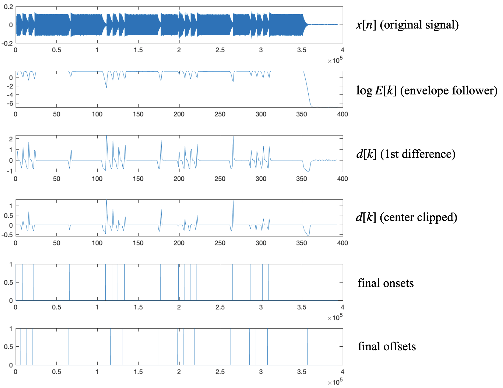
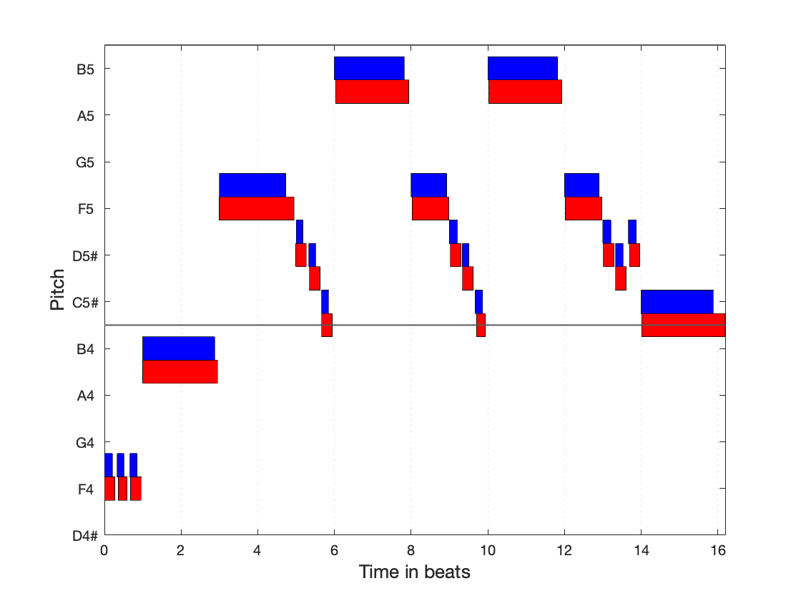
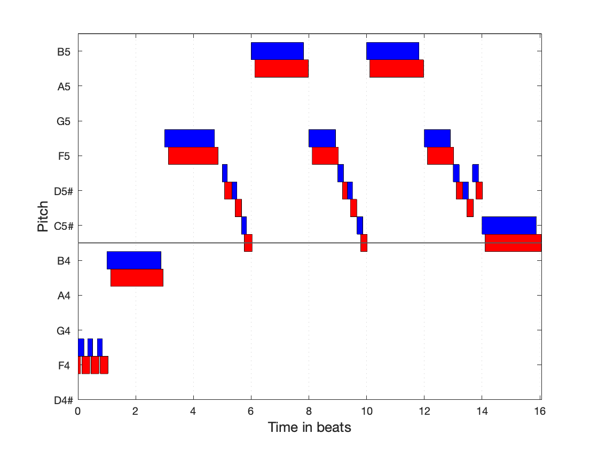
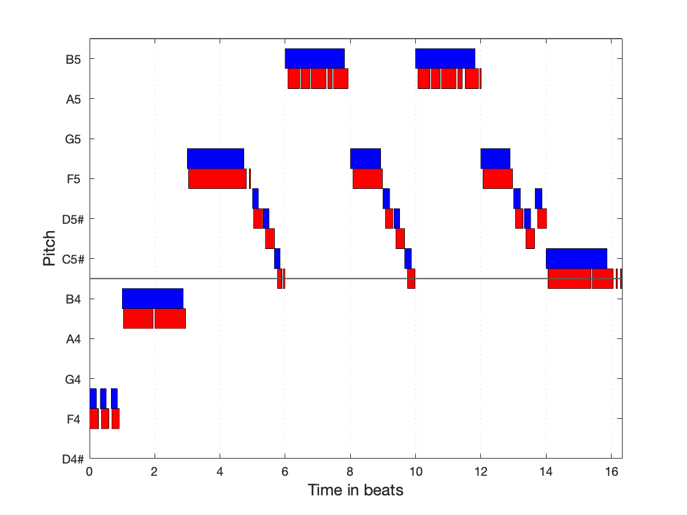
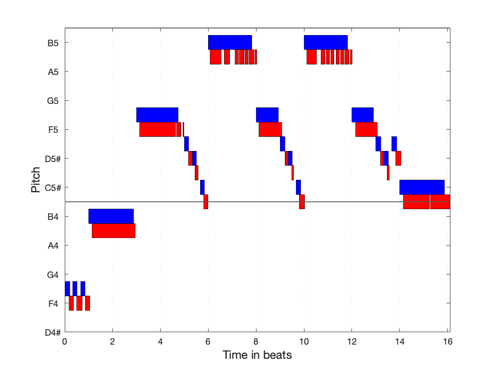
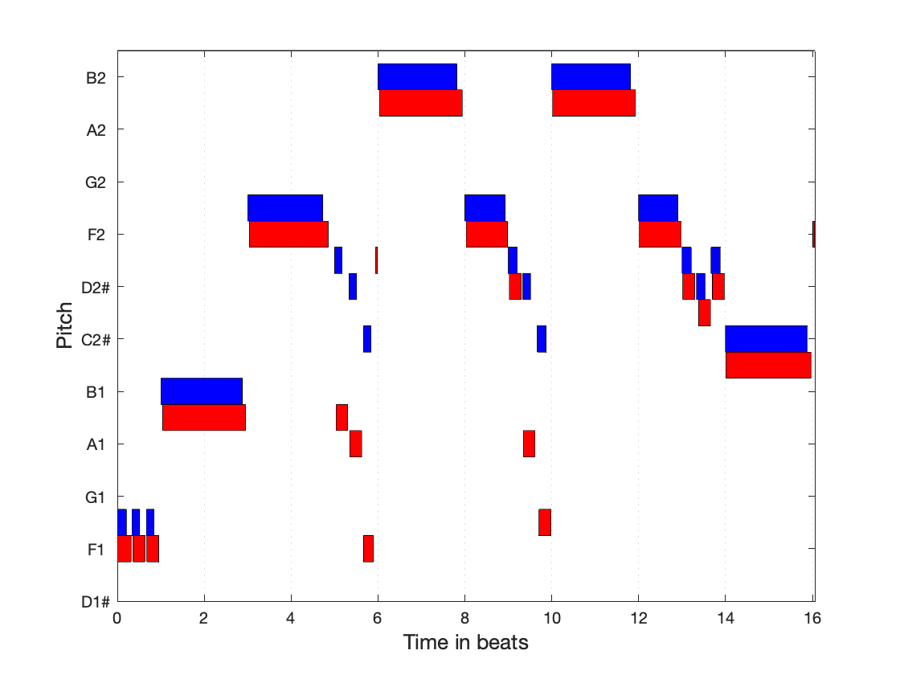
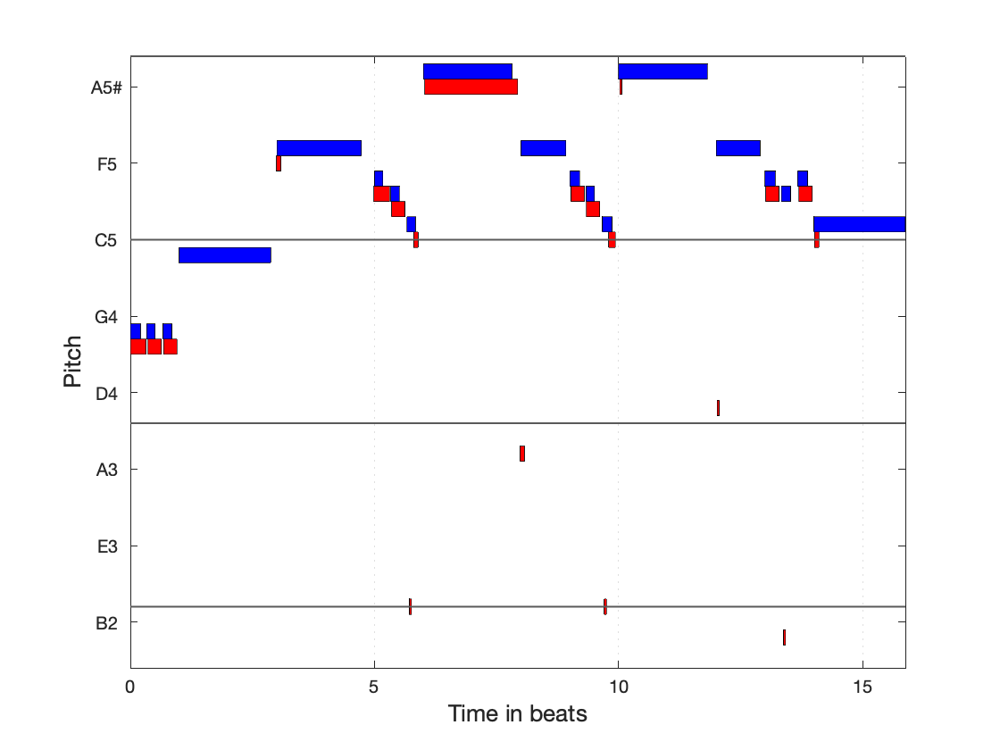

# **MIDI Transcription of Monophonic Music Recordings**

Kenneth Zheng

JHU EN.520.445 Audio Signal Processing (Fall 2020, Prof. Mounya Elihali)

## **I. Introduction **

For this project, my goal was to create an all-in-one system to transcribe musical notes from recorded melodies, for a wide range of musical instruments and styles. The expected inputs to my system are monophonic melodies (only one note at a time, no overlapping notes). My system outputs a MIDI (Musical Instrument Digital Interface) file which contains information about the pitch, onset, and duration of each of the transcribed notes, and can be directly used in a variety of music production and analysis applications.

This problem was personally interesting to me due to my background in music production - I have personally used an implementation of this to convert musical ideas recorded using a piano/guitar/voice into MIDI in order to have the flexibility of changing individual notes or using a different software instrument to play the same melody. It also has many other applications, including documenting and/or analyzing music without a written score.

My MATLAB code for the completed system is included with this report. To run it, run the `main.m` file using MATLAB (make sure that you include `/miditoolbox` and its subfolders in your path).

## **II. Problem Setup**

This problem can be broken down into a series of four sub-problems:

1. Note onset/offset detection
2. Pitch detection
3. Pitch quantization
4. MIDI encoding

Below is an overview of each step:

**1. Note onset/offset detection**

This step involves determining the exact sample corresponding to the start and end of each note. There are many challenges involved with this step. For example, onsets can be particularly difficult to detect if they aren't separated by silence. Additionally, the presence of background noise can make onsets much harder to detect. Furthermore, the definition of onset isn't even clear, since real-world instruments typically have a transient that can last a couple milliseconds, involving the signal rises to a peak and then decaying into the actual body of the note. 

Existing methods in the time domain usually involve some preprocessing step to downsample and remove pitch-related oscillations in the signal, a detection function that highlights possible onsets, and finally a peak-picking algorithm to choose the actual onsets. There are also some methods in the frequency domain, for example trying to detect transients based on their noise-like harmonic signature. For my implementation, I chose to implement a time-domain method using the basic formula outlined above, with a couple of my own tweaks.

This is mostly a solved problem, and in fact most modern DAWs (digital audio workstations) and other audio software have built-in implementations of this that work pretty effectively. Current research in this space has been focused on polyphonic (multi-pitch) transcription which is a much harder problem. Despite this, I thought that monophonic transcription would still be an interesting project to tackle that is within the scope of this class.

**2. Pitch detection**

This step involves identifying the fundamental frequency of pitched segment of audio (corresponding to one note). There are also various challenges to deal with in this step, most notably an "octave error" (misclassifying the pitch as an integer multiple of the fundamental) due to the presence of higher harmonics in real-world instrument timbres.

Existing methods in the time domain include using the zero crossing rate, autocorrelation, or AMDF (average magnitude difference function). Methods in the frequency domain include the FFT (Fast Fourier Transform), harmonic product spectrum, or cepstral analysis. My implementation uses a hybrid time/frequency domain method, using the autocorrelation to select candidate pitches and cross-referencing with the FFT to minimize octave errors.

**3. Pitch quantization**

This step involves snapping the detected pitch (in Hz) of each note to the closest note in 12-tone equal temperament (the standard tuning system for Western music). In equal temperament, each octave is split into twelve equally-spaced intervals, so that two notes a semitone apart have a frequency ratio of $2^{1/12}$. The reference pitch is usually as A4 = 440 Hz. Given this, it is pretty trivial to derive a formula that converts any frequency $f_n$ into the number of semitones away from A4:
$$
\text{semitones from A4}=12 * \log_2\frac{f_n}{440}
$$
**4. MIDI encoding**

This final step involves taking all of the pitch/onset/offset information from the previous step, and encoding it into a `.mid` file following the MIDI protocol that can be imported and used in other music software. For my implementation, I used `miditoolbox`, a third party MATLAB library, to accomplish this.

## **III. Implementation**

Below is a detailed description about the algorithms and implementation details of my code.

**1. Note onset/offset detection**

I implemented this as a MATLAB function `detect_onsets.m` which takes in an input signal $x[n]$, a window size $N$, and a clipping threshold $c$, and outputs two arrays corresponding to the sample indices of each detected onset and offset respectively.

First, the system uses an envelope follower, which splits $x[n]$ into frames of length $N$, with 50% overlap. For each frame $k$, the algorithm computes the short-term energy using a $N$-point Hann window $w[m]$:
$$
E[k] =\sum_{m=-\frac N 2}^{\frac N 2 - 1}(x[n+m-k])^2w[m]
$$
This envelope follower serves two purposes. Firstly, it acts as a lowpass filter to smooth out the high-frequency oscillations caused by the pitch information, while retaining the low-frequency information corresponding to changes in energy in the signal. Additionally, it also downsamples the signal significantly to reduce the amount of computations required in subsequent steps.

Then, I took the first difference of the log of this downsampled signal, which I'll denote as $d[k]$. The $\log$ improves accuracy of the predictions, since humans typically percieve changes in energy or loudness on a scale that is roughly logarithmic. The first difference step serves to highlight sections of the signal where the energy changes significantly, which is useful since onsets correspond to a rapid change from low to high energy, and offsets correspond to a change from high to low energy.

To clean up this difference signal, I used the threshold $c$ as a center-clipping threshold. Specifically, this involves setting $d[k]=0$ for all $k$ where $0 < d[k] < c$ or $-\frac12c<d[k]<0$. This removes any small oscillations in $d[k]$ that would otherwise be detected by the peak-picking function. I chose to use a smaller threshold of $\frac12c$ for the negative threshold (for offsets), since they are typically slower-changing than onsets and show up in $d[k]$ as valleys with smaller magnitude than their corresponding onset peaks.

Finally, I used MATLAB's `findpeaks` function to find the onsets (peaks) and offsets (valleys) of $d[k]$. I then convert the frame index $k$ of both arrays back to the corresponding sample index $n$ of the original input $x[n]$, and output these two arrays.

One extra small detail is that I zero-padded the beginning of $x[n]$ with $\frac N 2$ zeroes. This was necessary since the first onset of each of my test signals was usually very close to the first sample of the audio file, and was being consistently missed by the envelope follower since there isn't enough space to center the frame window around it. To compensate for this, I needed to subtract $\frac N 2$ from the final onset/offset sample values. I didn't need to do this for the end of $x[n]$ as my test signals all had plenty of silence at the end, although I imagine it would be necessary if the last offset was very close to the last sample as well. I also sometimes needed to add an extra offset value as the last sample, since the final offset was frequently missed by my algorithm.

For my final parameter values, I chose a window size $N=2000$ and a clipping threshold of $c=1.0$. I found that a window size of $2000$ (corresponding to a window length of $45.4\text{ms}$ for my test signals sampled at $44.100\text{kHz}$) provided sufficient smoothing of lower-pitched notes, while keeping enough frame resolution to distinguish shorter notes. I also tuned the clipping threshold $c$ to a value that worked well for the majority of my test signals, although having this be a fixed threshold was still impacting my performance quite a bit.

Below is a plot of the signal at each step of the onset detection pipeline for a synthesized test signal:

Figure 3.1: Note onset/offset detection pipeline

**2. Pitch detection**

I implemented this as a MATLAB function `detect_pitch.m` which takes in a pitched segment $x_i[n]$ (corresponding to the $i_{th}$ note detected from the previous step) and the sampling frequency $f_s$, and outputs the estimated pitch in $\text{Hz}$. 

Firstly, I compute the autocorrelation of $x_i$:
$$
R[k] = \sum_{n=-\infty}^{\infty} x_i[n]x_i[n-k]
$$
Peaks in the autocorrelation correspond roughly to periodicity in the signal. The simplest method to estimate pitch is simply to take the index $k$ where the autocorrelation is maximized, which I originally implemented. However, after experimenting with this I noticed that I was frequently running into octave errors, especially with instruments that have relatively high energy in their upper harmonics. To make this  I chose to cross-reference this with the FFT to be completely sure that I was correctly identifying the fundamental frequency and not an upper/lower harmonic.

To do this, I found each value of $k$ corresponding to an autocorrelation peak, converted them to pitches in Hz using the formula $p=f_s/k$, and stored them in a list of candidate pitches $P$. Then, I computed the FFT of the original $x_i[n]$, and picked out the first peak $k_{_{FFT}}$ and corresponding frequency $p_{_{FFT}}=(k_{_{FFT}} f_s)/N$. Finally, I outputted the pitch in my list of candidate pitches $P$ that was closest to the FFT estimate $p_{_{FFT}}$.

**3. Pitch quantization & MIDI encoding**

Implementing this part was fairly straightforward due to the great third party MATLAB library `miditoolbox`, which notably includes functions to convert pitch values to MIDI values, read/write MIDI files, and visualize MIDI in a piano roll format directly in MATLAB. My code for this part is written in `detect_notes.m` and `notes2nmat.m`.

Firstly, in `detect_notes.m`, I loop through each note (defined by an onset/offset pair from step 1), calculate the pitch in Hz (using method from step 2), and then convert the note's pitch in Hz to it's closest corresponding MIDI note value using the miditoolbox function `hz2midi`. I then return a tuple of $(\text{onset, duration, midi\_pitch})$ for each note.

Then, `notes2nmat.m` takes this array of notes, a predefined tempo (from the input signal), and does the neccesary calculations to convert the onset/duration into musical beats, and fit everything into a miditoolbox notematrix format.

**4. Driver code**

Finally, my driver code is in `main.m`. This script reads in a specified test file, optionally adds some Gaussian noise to the signal, runs my transcription system, and outputs a MIDI file `out.mid`. It also plots the transcription result and the ground-truth MIDI file it was generated from on a piano roll, which I found to be the best way of visually evaluating performance.

## **IV. Performance Evaluation**

For my test signals, I collected some MIDI melodies and used my DAW of choice (Logic Pro) to play each melody using a variety of sampled software instruments. Although this isn't super realistic (software instruments can't capture any of the nuances of sub-par recording equipment and room reflections), it already proved to be quite a challenge for my system to properly transcribe even these clean signals.

The instruments that I chose to analyze include piano, flute, clarinet, trumpet, violin, and electric bass. I chose these instruments since I believe they cover most of the timbral variation among commonly used instruments. I also included a sawtooth synthesizer to use as a baseline. Below is an analysis of my results for the same melody on each different instrument, ordered by best to worst performance. For each, I've plotted the reference (blue) and transcription result (red) side-by-side in a piano roll format. Note that the reference notes are pitched up by one semitone to enable easy visual analysis (the notes would otherwise be overlapping).

**1. Sawtooth Synthesizer**

This signal represents a near-ideal test case for my algorithm, since the synthesizer used has a very sharp attack transient, a well-defined offset, and no pitch variation during each note. As shown, my algorithm was able to identify the pitch and approximate onset/offset of each note correctly. However, the onsets/offsets aren't sample-exact, and specifically the detected offsets seem to consistently late. I think this is because my onset/offset detection algorithm detects peaks in the energy, which happens around the middle of each attack/release "transient". The effect is more noticeable in the offsets since they happen over a longer period of time than the onsets. Still, I think that this amount of error is perfectly acceptable and definitely useable in a music-production setting where notes usually are quantized to the closest beat subdivision anyway.

Another point is that a sawtooth waveform actually has a lot of higher harmonic energy, which was occasionally giving me octave errors when I was using only the autocorrelation for pitch detection. However, adding the FFT cross-referencing seemed to have fixed all of these.

**2. Trumpet**

The trumpet has a very similar harmonic envelope to a sawtooth wave, so I expected the performance to be similar, and it is. My algorithm was able to identify each note without errors, and only slightly missed each onset/offset. The onsets here seem to be slightly more off (later) than in the synthesizer case, probably because the attack transient of a trumpet is slightly longer (due to the "air" sound in the articulation). Again, I would classify this as essentially perfect performance.

**3. Clarinet**

The clarinet has a very different harmonic signature to both the trumpet and the sawtooth synth. It also usually much longer attack transient, but a relatively fast release. Here, we see that the onsets are pretty significantly late, such that some of the shorter notes occupy the time of the next (reference) note. There is also an extra note in the very beginning (not sure why this is). However, my algorithm was still able to capture every note and its corresponding pitch, even if the timing of each is no longer ideal.

**4. Violin**

For the violin, I get significantly worse performance on longer notes, with the algorithm detecting them as a series of shorter notes. This is because the software violin tries to emulate both a tremolo and a vibrato effect (tremolo is a a volume oscillation, while vibrato is a pitch oscillation). Both are widely used by violinists use as an expressive tool on longer notes. While the vibrato doesn't seem to have tripped up my pitch detection, the tremolo certainly fooled my onset detection algorithm, which classified some of the volume oscillations as separate onset/offsets.

**5. Flute**

The flute signal has a very similar issue to the violin, since the software instrument also tries to emulate a tremolo effect. Interestingly, there seem to be more gaps in the two highest notes. However, the pitch step detection still seems to be working great when given proper input, even though the harmonic characteristics of the flute and violin are pretty different. This is good since it means that with some post-processing (such as combining short notes with the same pitch together) it is definitely possible to get a useable result.

**6. Electric Bass**

Note that the electric bass signal is generated from a MIDI file that is 3 octaves lower than the other instruments (corresponding to the low-end of the range of a standard bass guitar), since I wanted to test my algorithms performance on very low notes. Here, we see that the pitch detection is the main source of error, with a couple shorter notes being misclassified as a perfect fifth below their actual values. This is probably because these short, low notes don't have enough pitch periods for the autocorrelation method to work confidently, and also likely don't have enough samples to get a good frequency resolution using the FFT. We can also see two small errors in the onset detection (around beats 6 and 16), probably due to the unique articulation of bass guitar strings.

**7. Piano**

Clearly, my algorithm performed very poorly on the piano signal, producing a pretty much unusable result. This was surprising to me at first, as I'd originally expected the piano to be a fairly easy instrument to transcribe due to its sharp attack and consistent pitch. However, I now see the issue - the piano has a unique property where a played note decays over time (a property which none of my other tested instruments have). This significantly tripped up my offset detection, which seemed to consistently classify the offset as the initial decay of each note, instead of the final release of the key. I think that this is an inherent limitation of my offset detection algorithm, and if I were to do this project again I would focus on using a different approach that was more resistant to note decay.

**Robustness under noise**

Finally, I also did some testing to see how robust my algorithm was under varying amounts of noise. For this test, I used the synthesizer audio file, and experimented with changing the amplitude of the added Gaussian noise. Although this is clearly a very synthetic test, it should give an indication of the best-case scenario of transcribing a signal with varying amounts of noise. Below is a table of my results:

| **Noise Multiplier** | **SNR (dB)** | **Notes Missed** | **Observations**                                             |
| -------------------- | ------------ | ---------------- | ------------------------------------------------------------ |
| 0                    | $\infty$     | -1               | Absolutely no noise actually introduced one extra note at the very end, possibly since it was picking up on very small differences that would have been masked by noise |
| 0.001                | 35.22        | 0                | Baseline performance from above results                      |
| 0.01                 | 15.37        | 0                | Still essentially perfect                                    |
| 0.02                 | 9.71         | 0                | Still essentially perfect                                    |
| 0.03                 | 6.71         | 8                | Many notes missed                                            |
| 0.05                 | 3.66         | all              | Classified entire sequence as one note                       |

As shown, performance in the presence of noise isn't great, producing unusable results on anything with a SNR higher than about 6.71 dB. However, it should work well at anything below a 10-15dB SNR. This means it should work fine in studio applications, but will likely perform poorly with live recordings.

## **V. Summary**

Overall, I learned a lot from this project. I am pretty satisfied with the robustness my pitch detection algorithm, and recognize that my onset/offset detection method has some significant limitations. If I had more time to continue this project, I would likely try other methods of onset/offset detection (including maybe different algorithms for onset and offset), in order to address some of the issues with note decay and tremolo. I would also add a post-processing layer to the pipeline, to clean up the final MIDI output (e.g. by combining/removing very short notes).

All my code, the  `miditoolbox` library (v1.1), and all the test signals to generate the figures in this report are included with my submission. To use the system, run the `main.m` file using MATLAB (make sure that you include `/miditoolbox` and its subfolders in your path).

## **VI. References**

[1] Bello, J.P. (2003). Towards the automated analysis of simple polyphonic music: A knowledge-based approach. Ph.D. Thesis, University of London.

[2] Bello, J.P., Daudet, L., Abdallah, S., Duxbury, C., Davies, M., Sandler, M. (2005). A Tutorial on Onset Detection in Music Signals. *Speech and Audio Processing, IEEE Transactions* on. 13. 1035 - 1047. 10.1109/TSA.2005.851998. 

[3] Benetos, E., Dixon, S., Giannoulis, D., Kirchhoff, H., Klapuri, A. (2013). Automatic music transcription: Challenges and future directions. *Journal of Intelligent Information Systems*. 41. 10.1007/s10844-013-0258-3.

[4] Eerola, T., Toiviainen, P., (2004). MIDI toolbox: MATLAB tools for music research. 

[5] Müller, M., Ellis, D., Klapuri, A., Richard, Gaël., (2011). Signal Processing for Music Analysis. *Selected Topics in Signal Processing, IEEE Journal* of. 5. 1088 - 1110. 10.1109/JSTSP.2011.2112333. 

[6] Tan, L., Karnjanadecha, M. (2003). Pitch detection algorithm: autocorrelation method and AMDF. 

